Developer Guide
===============

Database Design
---------------

**E/R Diagram of Database**

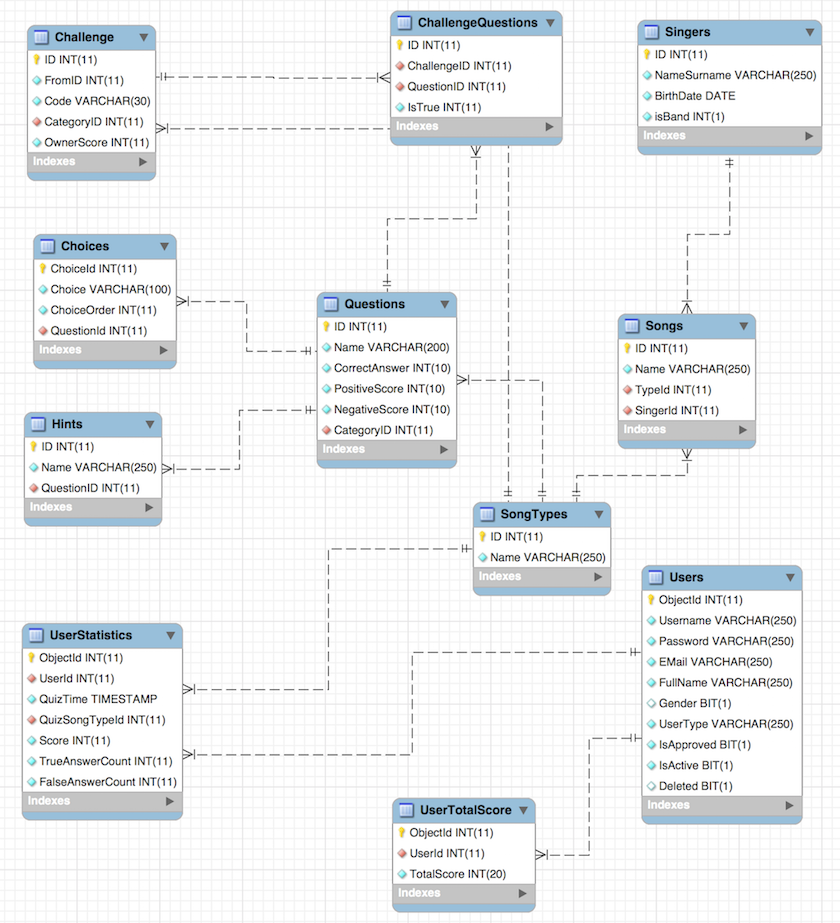
..

Users Table
###########

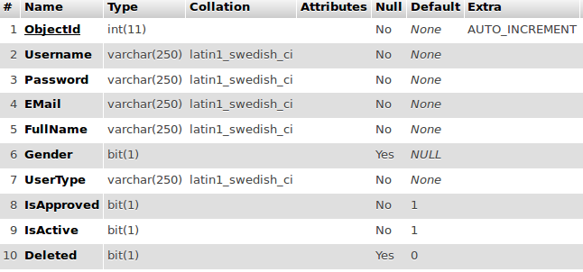
..

**ObjectId**: It holds a unique number for each user. 
   Technical Features: int, PRIMARY KEY, AUTO_INCREMENT
**Username**: It holds a username for authentication.
   Technical Features: varchar(250), NOT NULL
**Password**: It holds a password for authentication with SHA-1 encryption algorithm.
   Technical Features: varchar(250), NOT NULL
**EMail**: It holds an e-mail address for users who signed up. It will use quiz part.
   Technical Features: varchar(250), NOT NULL
**FullName**: It holds full name of users.
   Technical Features: varchar(250), NOT NULL
**Gender**: It holds gender of users. If the user is male, value of this column set 1,otherwise set 0.
   Technical Features: bit(1)
**UserType**: It holds type of users such as “user” and “admin”
   Technical Features: varchar(250), NOT NULL
**IsApproved**: After a user signed up, it is set 0 until one of admins approve this user.
   Technical Features: bit(1), Default 0
**IsActive**: It holds whether a user is active or not. If it is active, it will be 1. Otherwise it will be 0.
   Technical Features: bit(1), Default 1

UserStatistics Table
####################

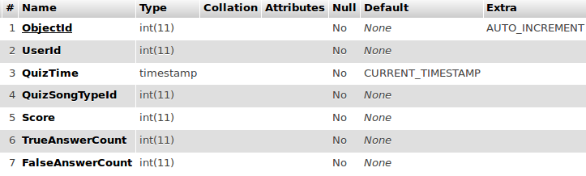
..

**ObjectId**: It holds a unique number for each tuple. 
   Technical Features: int, PRIMARY KEY, AUTO_INCREMENT
**UserId**: It holds User id number to find which user get this scores.
   Technical Features: int, NOT NULL ,Referances to Users.ObjectId
**QuizTime**: It holds timestamp for quiz time.
   Technical Features: timestamp, NOT NULL, Default CURRENT_TIMESTAMP
**QuizSongTypeId**: It holds type of quiz.
   Technical Features: int, NOT NULL, References to SongTypes.ID
**Score**: It holds score for current quiz.
   Technical Features: int, NOT NULL
**TrueAnswerCount**: It holds how many true answer for this quiz.
   Technical Features: int, NOT NULL
**FalseAnswerCount**: It holds how many false answer for this quiz.
   Technical Features: int, NOT NULL

UserTotalScore Table
####################

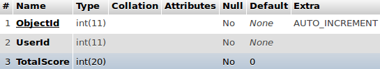
..

**ObjectId**: It holds a unique number for each tuple. 
   Technical Features: int, PRIMARY KEY, AUTO_INCREMENT
**UserId**: It holds User id number to match total score and users.
   Technical Features: int, NOT NULL, Referances to Users.ObjectId
**TotalScore**: It holds total score of users.
   Technical Features: int, NOT NULL,Default 0

Questions Table
#########################################################################

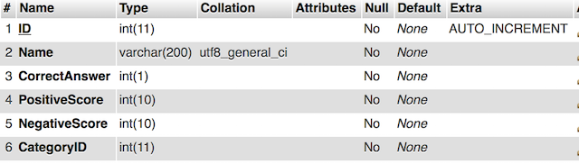
..

**ID** It holds a unique number key which cannot be null to point single question
   Technical Features: int(11), PRIMARY KEY, AUTO_INCREMENT
**Name** It holds a text of question.
   Technical Features: varchar(200), NOT_NULL, UNIQUE
**CorrectAnswer** It holds a number that represents which choices of single question correct. It starts with 0.
   Technical Features: int(1), NOT_NULL
**PostiveScore** It holds a score of giving correct answer of question
   Technical Features: int(10), NOT_NULL
**NegativeScore** It holds a score of giving wrong answer of question
   Technical Features: int(10), NOT_NULL
**CategoryID** It holds an integer value that point id of SongTypes table.
   Technical Features: int(11), FORGEIN KEY, NOT_NULL

Hints Table
#########################################################################

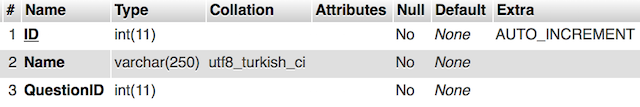
..

**ID** It holds a unique number key which cannot be null to point single hint
   Technical Features: int(11), PRIMARY KEY, AUTO_INCREMENT
**Name** It holds a text of hint.
   Technical Features: varchar(250), NOT_NULL
**QuestionID** It holds an integer value that point ID of Questions table.
   Technical Features: int(11), FORGEIN KEY, NOT_NULL 

Choices Table
#########################################################################

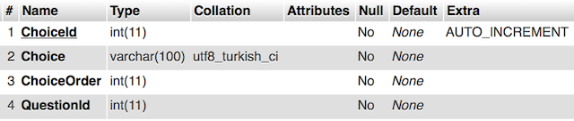
..

**ChoiceId** It holds a unique number key which cannot be null to point single choice
   Technical Features: int(11), PRIMARY KEY, AUTO_INCREMENT
**Choice** It holds a text of choice.
   Technical Features: varchar(100), NOT_NULL
**ChoiceOrder** It holds a number that represents order of choices. Ex. 0 represent first choice of questions and 1 represent second choice of questions ...
   Technical Features: int(1), NOT_NULL
**QuestionID** It holds an integer value that point ID of Questions table.
   Technical Features: int(11), FORGEIN KEY, NOT_NULL 

Challenge Table
#########################################################################

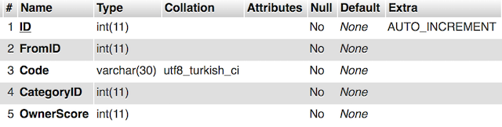
..

**ID** It holds a unique number key which cannot be null to point single challenge request.
   Technical Features: int(11), PRIMARY KEY, AUTO_INCREMENT
**FromID** It holds a user id number of challenger.
   Technical Features: int(11), NOT_NULL
**Code** It holds a string type code of challenge
   Technical Features: varchar(30), NOT_NULL
**CategoryID** It holds an integer value that point id of SongTypes table.
   Technical Features: int(11), FORGEIN KEY, NOT_NULL
**OwnerScore** It holds a score of challenger based on single challenge request.
   Technical Features: int(11), NOT_NULL  

ChallengeQuestions Table
#########################################################################

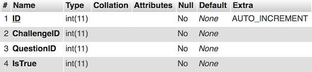
..

**ID** It holds a unique number key which cannot be null to point single challenge questions.
   Technical Features: int(11), PRIMARY KEY, AUTO_INCREMENT
**ChallengeID** It holds a integer value that point single  tuple of challenge table.
   Technical Features: int(11), FORGEIN KEY, NOT_NULL
**QuestionID** It holds an integer value that point ID of Questions table.
   Technical Features: int(11), FORGEIN KEY, NOT_NULL 
**IsTrue** It holds an integer value that represent whether questions is correct or not.
   Technical Features: int(11),  NOT_NULL

Songs Table
#########################################################################

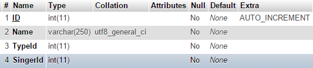
..

**ID:** It holds a unique number which cannot be null for song
   Technical Features: int(11), PRIMARY KEY, AUTO_INCREMENT
**Name:** It holds a name of the song
   Technical Features: varchar(250), NOT NULL, UNIQUE
**TypeId:** It holds number which is refers to the song type id
   Technical Features: int(11) , NOT NULL
**SingerId:** It holds number which is refers to the song singer id
   Technical Features: int(11) , NOT NULL

Singers Table
#########################################################################

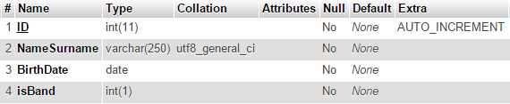
..

**ID:** It holds a unique number which cannot be null for singer
   Technical Features: int(11), PRIMARY KEY, AUTO_INCREMENT
**NameSurname:** It holds a name and surname of the singer
   Technical Features: varchar(250), NOT NULL, UNIQUE
**BirthDate:** It holds a birth date of the singer
   Technical Features: date, NOT NULL
**isBand:** It holds a 0 or 1 which means singer is band or person
   Technical Features: int(1) , NOT NULL

SongTypes Table
#########################################################################

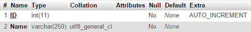
..

**ID:** It holds a unique number which cannot be null for song type
   Technical Features: int(11), PRIMARY KEY, AUTO_INCREMENT
**Name:** It holds a name of the song type
   Technical Features: varchar(250), NOT NULL, UNIQUE
   

Code
----

.. toctree::

   member1
   member2
   member3
   