Parts Implemented by Emre TEOMAN
================================

Login Panel
-----------

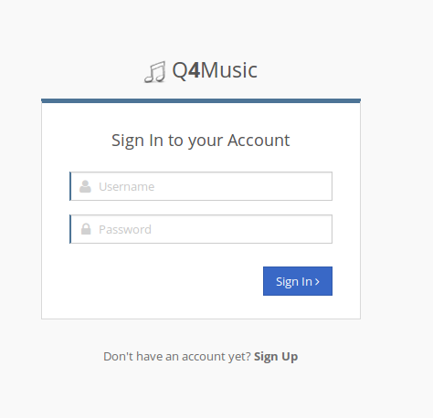
..

Login page is in left side. User can write username and password to text fields then click the Sign In button to sign in the web site. But if there is no account this web site, the user must click the  sign up button and fill the form. Sign up part of login screen will come with an animation. This is a client side feature.

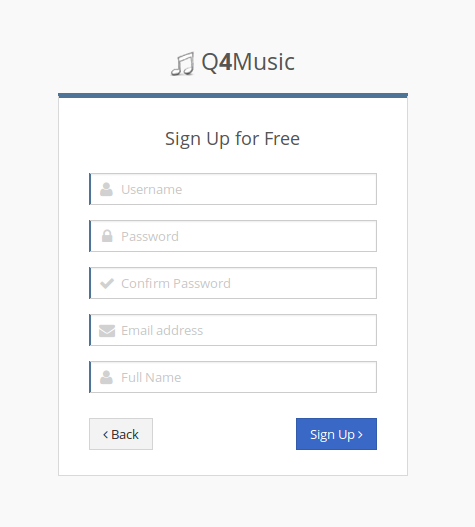
..

Sign up is required username, password, email address and full name of the user. After the filling this fields and click the sign up buttons user can be added but cannot login directly because admin users have to approve this new registration. Only after this, user can directly login this web site. For demonstration, user can immediately login the web site without any approve. 

Admin User Management
---------------------

Only users who has admin permission can see this page. It is seen like that :

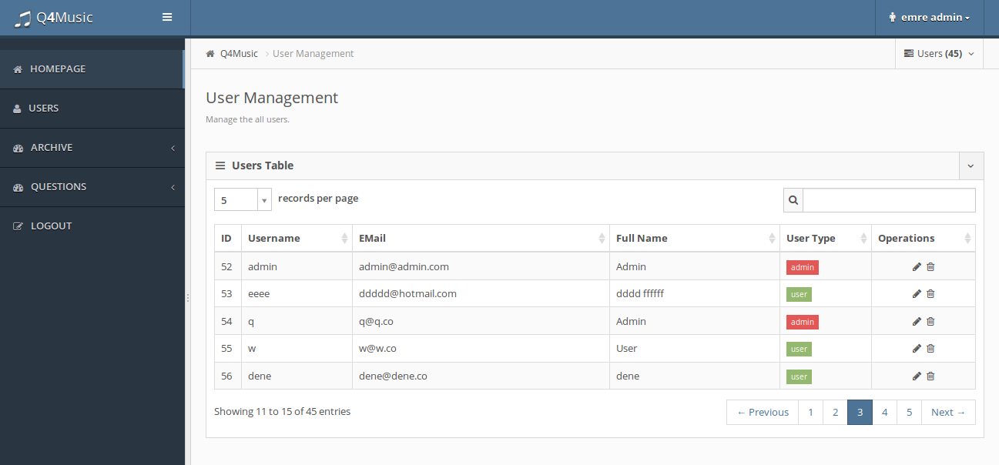
..

There is a list in here. Thanks to this list, all users include admin users can easily managed.  Search panel of the list is very useful, it can search everything such as full name, user name and id. User type column is colorful. Green means that the user has type user and its IsActive and IsApproved features are 1, so they can directly login. Red means that the user has admin permission. Yellow means that it is a user but it is not active or it is not approved, so the user who has yellow color, cannot login the web site. 
Operation column has two different operation for management. One of this is edit. It has pencil icon. When click the edit button, a modal opened :
With this modal, user can edit by admin users. Current user name, email address, user type and active status is seen on it. Then, this information about the user can change in here. After enter the new value of this fields, save changes buttons will be update user information. For example, the user who has username muziksever, has user type as user. If admin users can change the type of this user from User to Admin, this user can see the admin pages. Or admin users can change the user activation to false and then the user cannot access the web site.

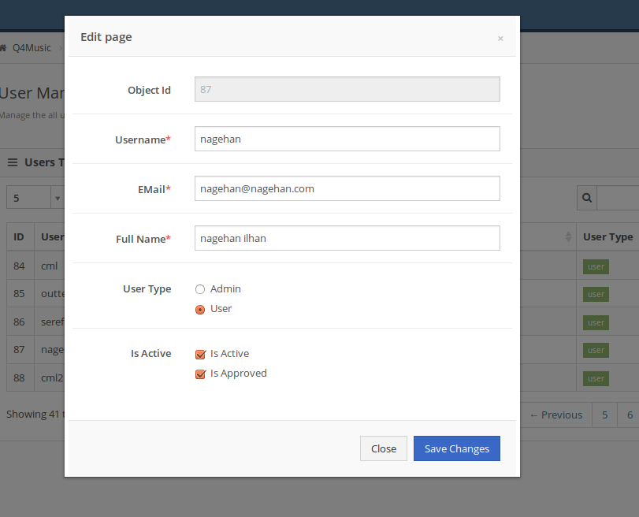
..

Other operation is delete operation and it can be represented as trash icon. Admin users can delete whoever they want. As a precaution, a confirmation box is alert and ask that are you sure. After the YES, selected user will be deleted permanently. 

Top right side of the page, there is a drop down list which shows the number of users in this system. Sub item of this list is a button which is used for add new user. Add user part is like the edit modal. It is used for administratively adding user without sign up part. Most usage are of this part is to add new admin user. 

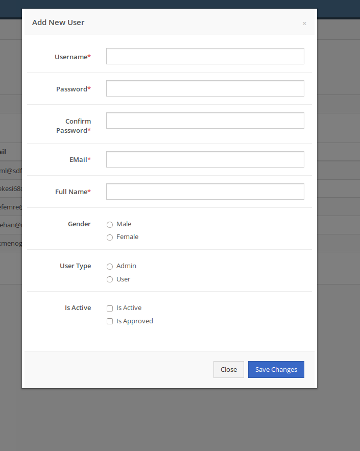
..

Profile
-------

Users can manage own account and can look at own statistics using this links.

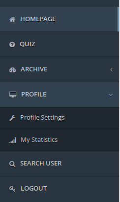
..

It is on the left panel.

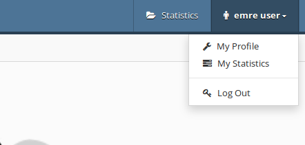
..

It is on the header of web site.

Profile Settings
^^^^^^^^^^^^^^^^

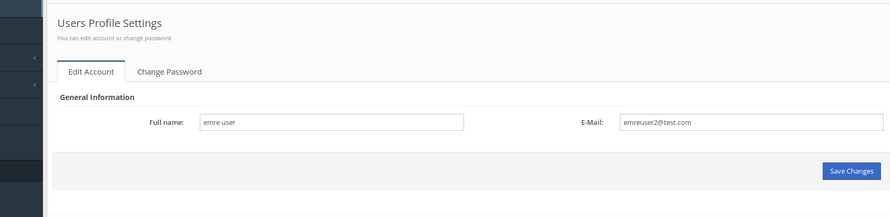
..

Users can edit own account such as full name and email address. In same way, with the help of change password tab, users can change own password.

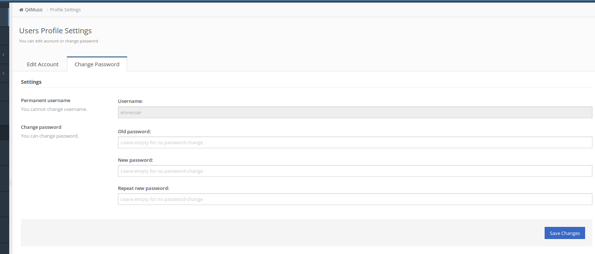
..

My Statistics
^^^^^^^^^^^^^

By cliking my statistics links, the user can look at own scores.

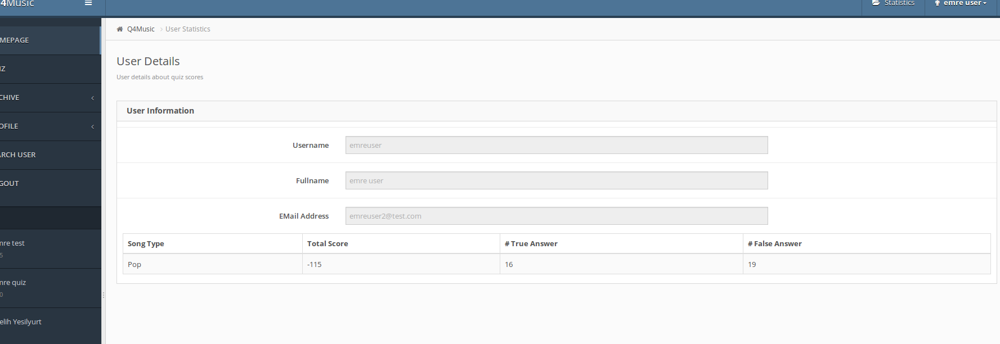
..

In addition to that, there is a one place to show score of users. It is located in header panel named Statistics and it is like that when it is clicked : 

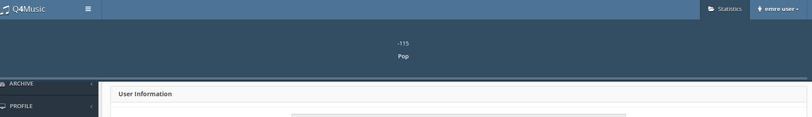
..

-----------
Search User
-----------

In this page, a user can search another user by full name. If there is a result, they will list in User Result table with username, full name, total score, number of true answer, number of false answer and a details link.

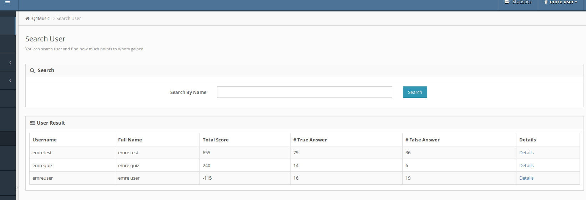

After the click details button, User Details page will opened. This page contains username, fullname and email of the user in additon to the score of users. In this page, it is clearly seem each song type and own score.

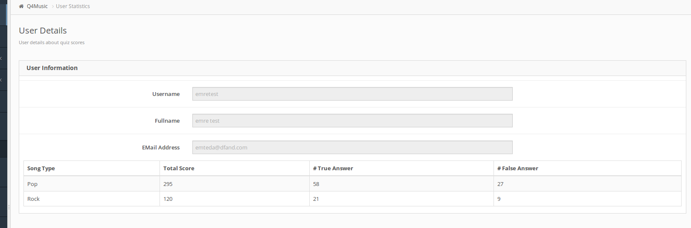
..

--------
Top List
--------

In addition to all of these, there is a top list in left panel. This list shows top 5 users which have higher scores.

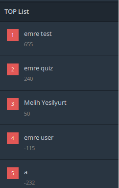

