Parts Implemented by Halim Burak Yeşilyurt
==========================================

User Side
---------

Quiz Category Page
^^^^^^^^^^^^^^^^^^

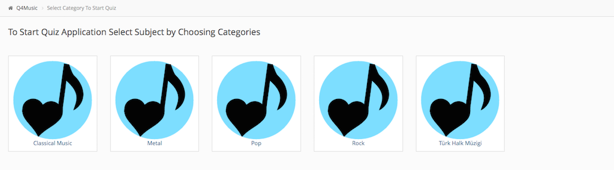

   Quiz Category Page

This page represent available quiz categories to user choice for entering quiz. It has category box that includes link and image. 
When user clicks link page redirects to quiz page according to user category choice

Quiz Page
^^^^^^^^^

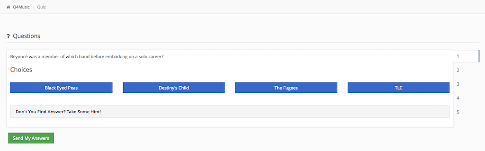

   Quiz Page

In this page, 5 question and question's hint and 4 choices are shown. User can select his/her answer of question. When user choice any choice, background of choice button change from blue to red. 
Also If user click 'Don't You Find Answer? Take Some Hint! link, hint will be appear by sliding from top to down. User can change question by clicking right sided tab button. 
After finishing all question, user clicks 'Send My Answers' button to send server and user redirects quiz result page. 

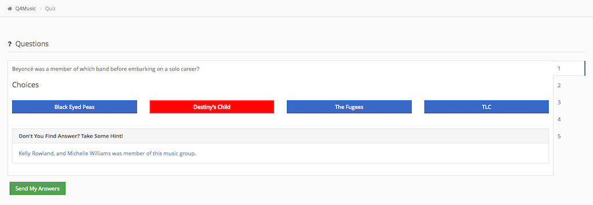

   Quiz Page

In this picture which loacates above of this line, 'Destiny's Child' answer was selected and user clicked hint show link.

Quiz Result Page
^^^^^^^^^^^^^^^^

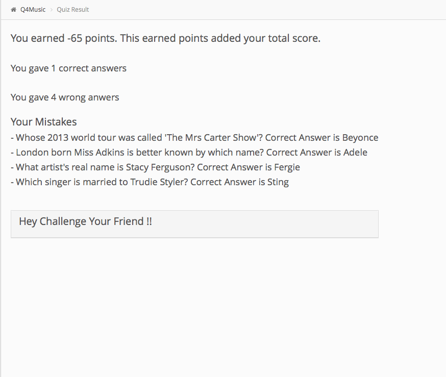

   Quiz Result Page

In this page, after sending choices to server, it respons information to user. User can see this information on quiz result page. Responsed information consists of number of users correct or wrong answer and which questions are wrong and its correct answers. 
Also this page contains "Hey Challenge Your Friend !!" link. 
When user clicks this link, challenge form will be appear which consits of 2 input are which are opponent name and email to send challenge request.

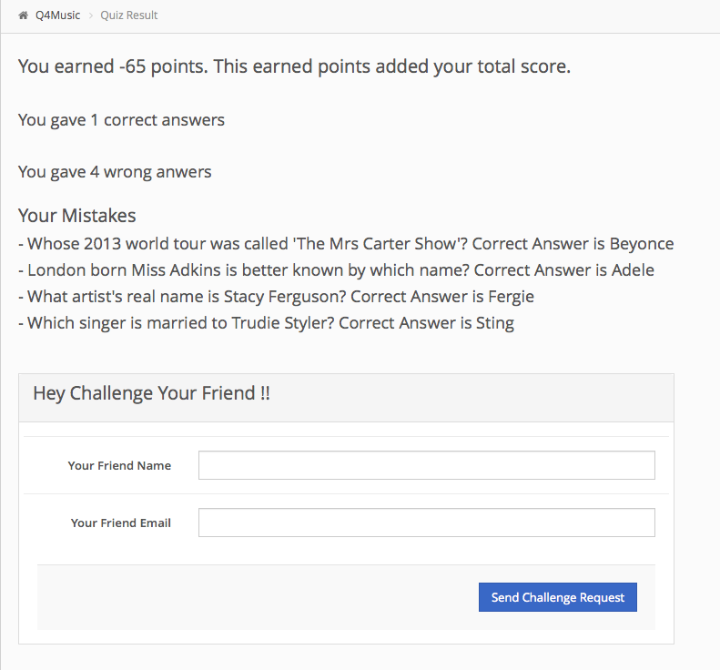

   Quiz Result Page with challenge me collapsed

Above image represents quiz result page whose challenge link is pressed. User can fill challenge request form's fields with his/her friends informations.

Challenge Email
^^^^^^^^^^^^^^^

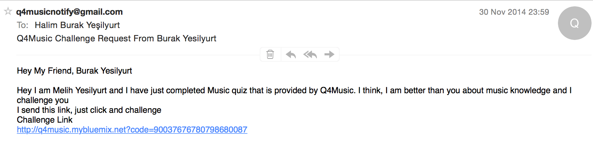

   Sample Challenge Email

Challenge mail image  represent sample of challenge request which is sent to opponent by challenger. This email consists of link with code that is used to deciding which questions will be shown up.

Admin Side
---------

Quiz Management Menu
^^^^^^^^^^^^^^^^^^^^

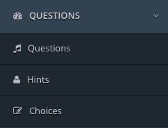

   Quiz Management Menu

In the left menu panel, there are 3 menus questions, hints and choices for admin home page.

Question Management
^^^^^^^^^^^^^^^^^^^

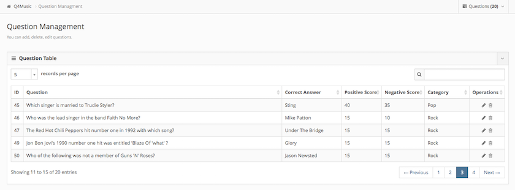

   Question Management Page

In this page, there is question table that has adjustable number of viewing entries, javascript powered search box, question add, delete,and edit button. 
When adding question. question modal page will appear and it consists of question, hint, choice fields therefore, thare is only way to add hint, choice, question to add.

To add question just click button which is in belowed image

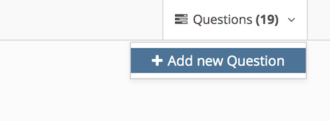

   Add Question Button

|

After clicking add question button, add question modal will be appeared. This image represent add question modal.

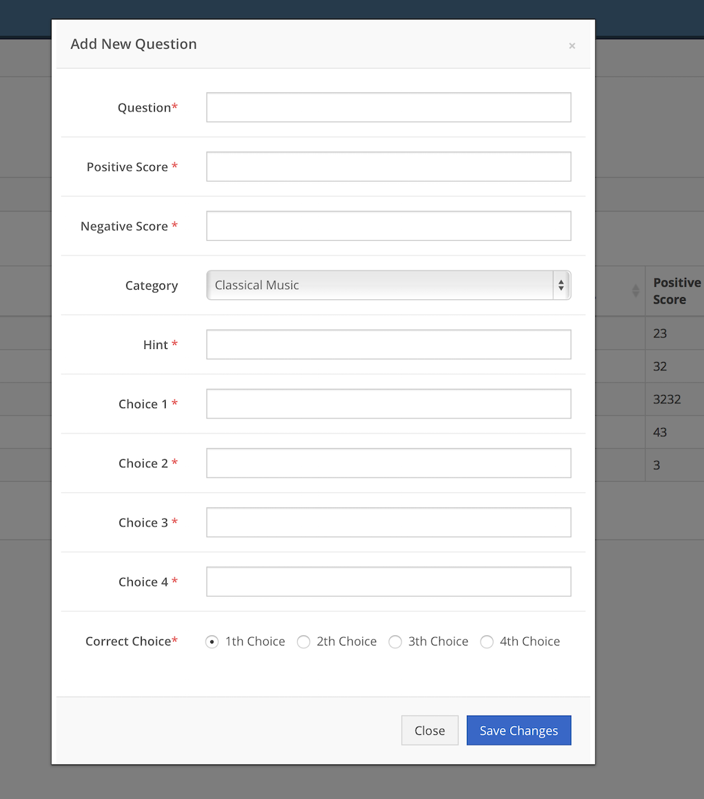

   Question, Hint, Choice Add Modal
|

To edit question user click pencil figure at operation column of table, and edit model immediately comes to middle of screen. It comes with filled fields according to data. 
Edit model is like that;

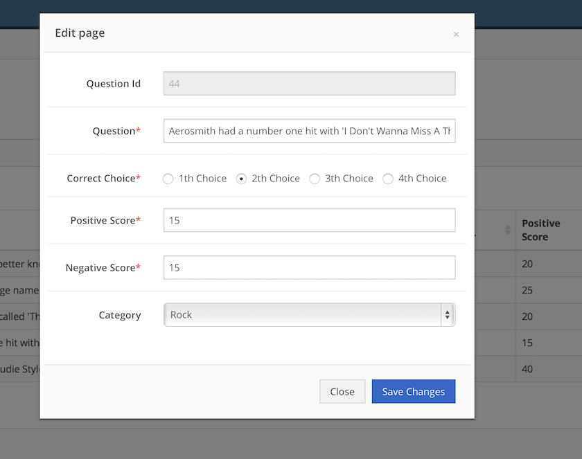

   Question Edit Modal
|

To delete question, we will be clicked trashcan figure button which is located at operation column of each row. 
After clicking delete button, delete confirmation will appear. If user clicks ok button of confirmation view, system deletes question, question's hint and 4 choices.
There is only way to delete hint. choice and question.

Confirmation view is like that;

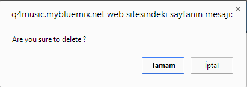

   Question Delete Confirmation Box

Choice Management
^^^^^^^^^^^^^^^^^

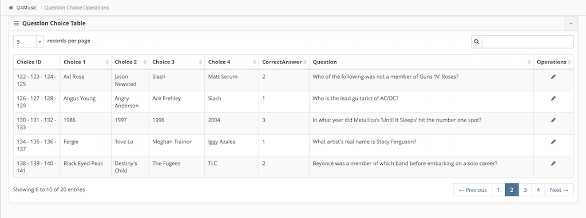

   Choice Management Page
|

In this page, there is choices table that has adjustable number of viewing entries, javascript powered search box, choice edit button. 
When user wants to edit choices, it is enought to click pencil figure at operations columns then edit choice model will be appeared.
Edit model appears with filled fields with related data. 
Edit choice modal is like that;

|

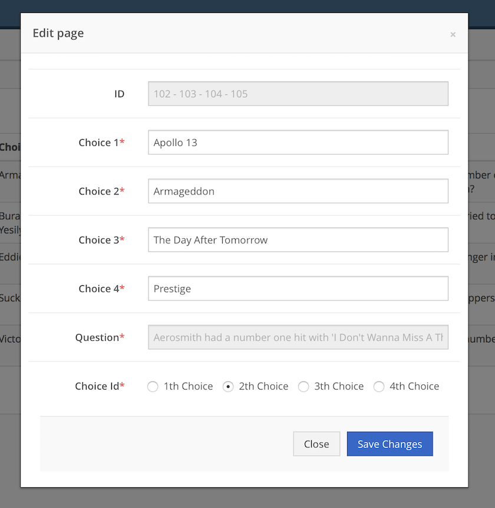

   Choice Edit Modal
|
   
After clicking Save Changes button any changes will transmits to database.

Hint Management
^^^^^^^^^^^^^^^

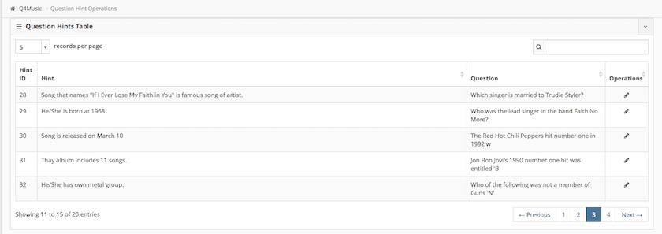

   Hint Management Page

In this page, there is hint table that has adjustable number of viewing entries, javascript powered search box, choice edit button. 
When user wants to edit hint, it is enough to click pencil figure at operations columns then edit choice model will be appeared. 
Edit model appears with filled fields with related data. 
Edit hint modal is like that;

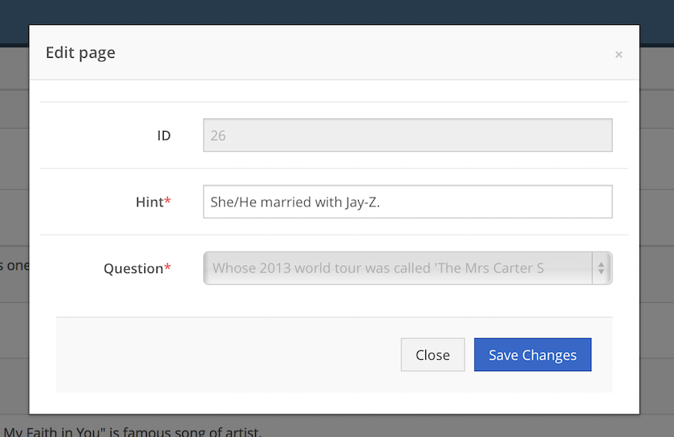

   Hint Edit Modal

|

After clicking Save Changes button any changes will transmits to database.

