Parts Implemented by Seref Bulbul
=================================

User Side Database Tables
-------------------------

Home Page
^^^^^^^^^

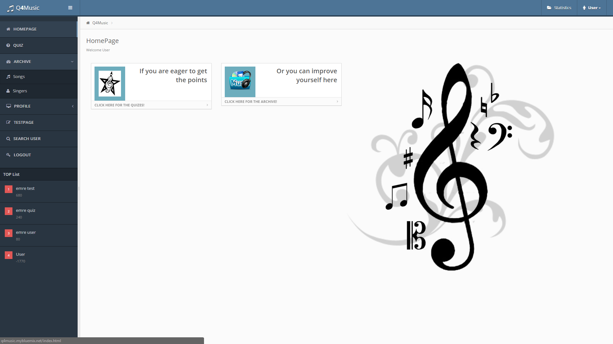

   User Home Page

When we login into Q4Music, this page welcomes us. There are two options, going to quizes page and going to archive(songs) page. Also, in the left panel there are two menus songs and singers.

Songs Table List
^^^^^^^^^^^^^^^^

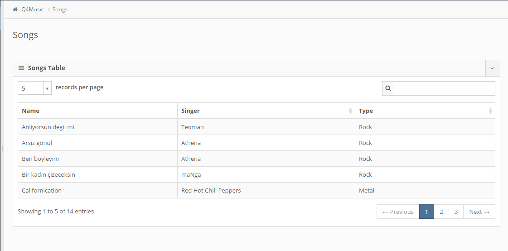

   User Song Table

In this page, all songs which are in the database, are listed. People can read them to improve themselves by reading songs' names, singers and types. In addition, they can search a song from top right text field. By clicking the columns' headers, values can be sorted in ascending or descending order. 

Singers Table List
^^^^^^^^^^^^^^^^^^

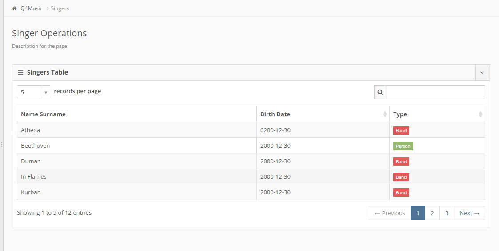

   User Singer Table

In this page, all singers which are in the database, are listed. People can read them to improve themselves by reading singers' name surnames, birth dates and types. In addition, they can search a singer from top right text field. By clicking the columns' headers, values can be sorted in ascending or descending order.

Admin Side Database Tables
-------------------------

Home Page
^^^^^^^^^

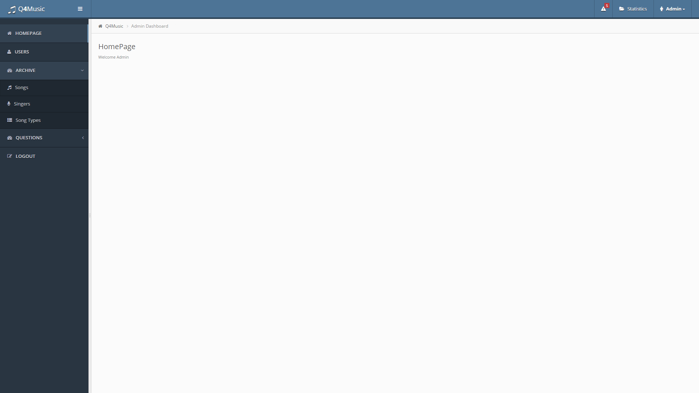

   Admin Home Page

In the left panel, there are 3 menus songs, singers and song types for admin home page.

Songs Table
^^^^^^^^^^^

Songs are the center of the logic. After any edit or delete operations, system checks whether there is singer/song type connected with any song. If there is not, system deletes that singer/song type.

List
""""

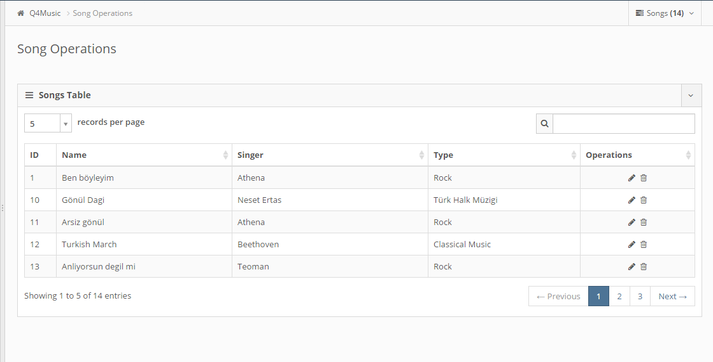

   Admin Song Table

Songs are listed with the ids, names, singers and types in this page. In addition, there are three type operations edit, add and delete.

Edit
""""

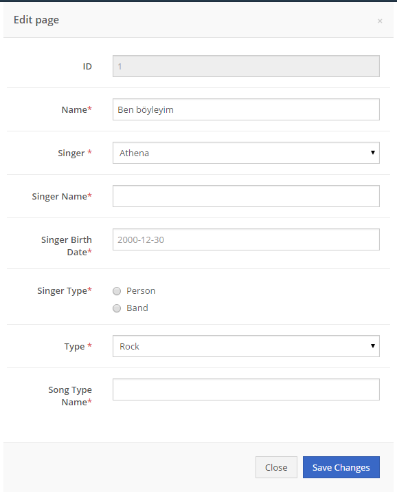

   Admin Song Edit Modal

This modal is set with the chosen row's values. Admin can change the singer or song type with the existing one or he/she can add a new singer or song type by choosing "Other" from drop down choices. For new singer or song type, all related fields should be filled.

Add
"""

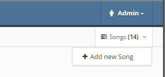

   Admin Add New Song Button

By clicking that button, add modal will be opened which has the same structure with the edit modal. It comes with empty text fields.

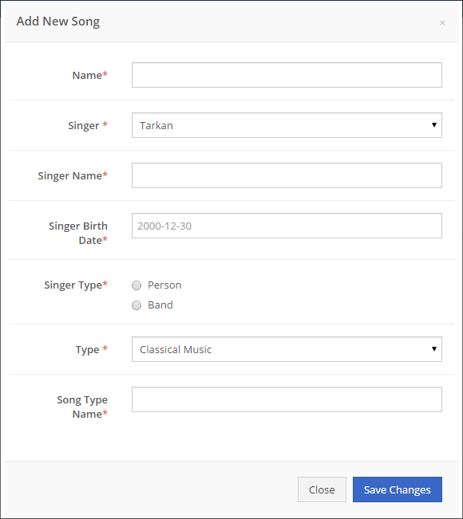

   Admin Song Add Modal

Delete
""""""

.. figure:: AdminSongDeleteOperationConfirmation.png
   :scale: 100 %
   :alt: Admin Song Delete Operation Confirmation
   :align: center

   Admin Song Delete Operation Confirmation
   
By clicking trash button in the table, this confirmation window will appear. As a precaution, it asks that are you sure. After the positive confirmation, selected song will be deleted permanently.

Singers Table
^^^^^^^^^^^^^

List
""""

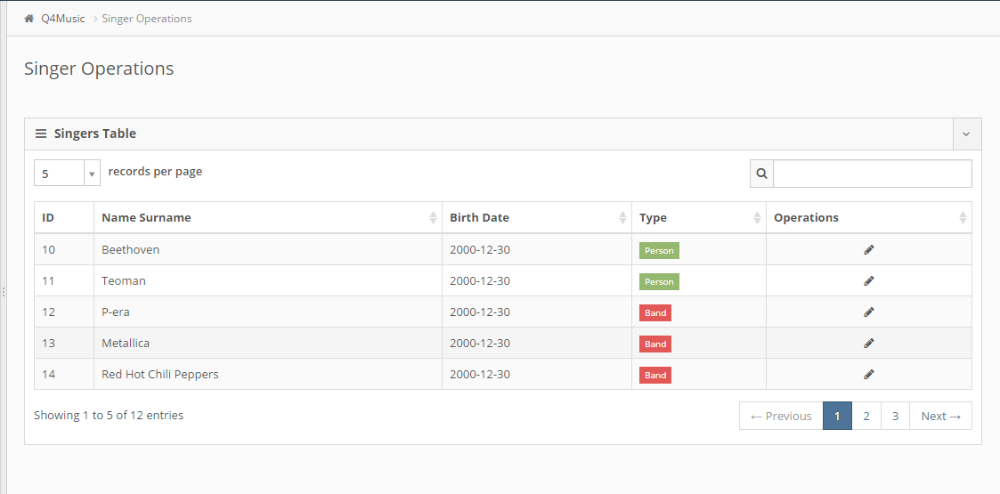

   Admin Singer Table

Singers are listed with the ids, name surnames, birth dates and types in this page. Since singers can be add from songs side and they are always connected with the songs, there is only edit option for singers.

Edit
""""

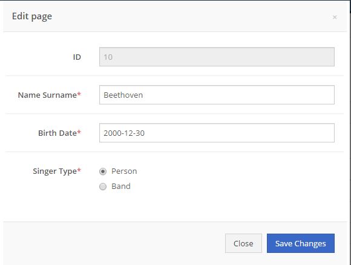

   Admin Singer Edit Modal

This modal is set with the chosen row's values. Admin can change the singer's name surname, birth date and type.

SongTypes Table
^^^^^^^^^^^^^^^

List
""""

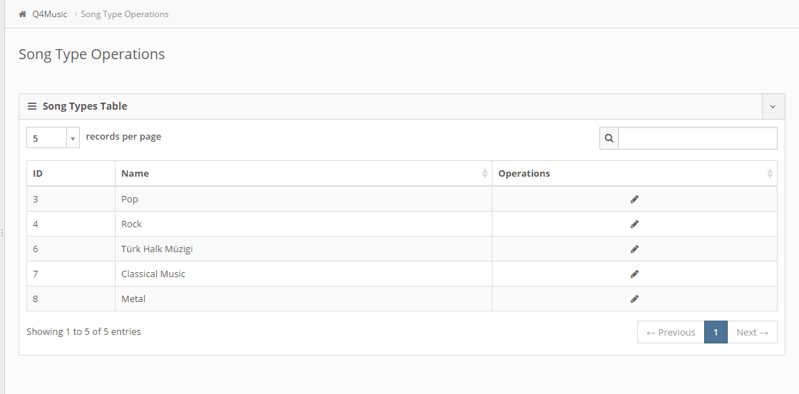

   Admin Song Type Table

Song types are listed with the ids and names in this page. Since song types can be add from songs side and they are always connected with the songs, there is only edit option for song types.

Edit
""""

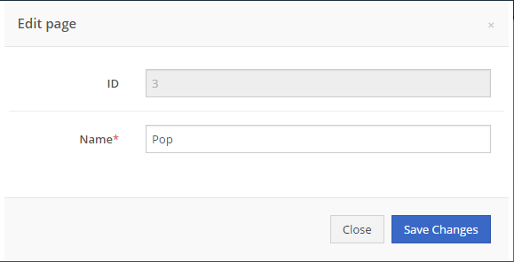

   Admin Song Type Edit Modal

This modal is set with the chosen row's values. Admin can change the song type's name.